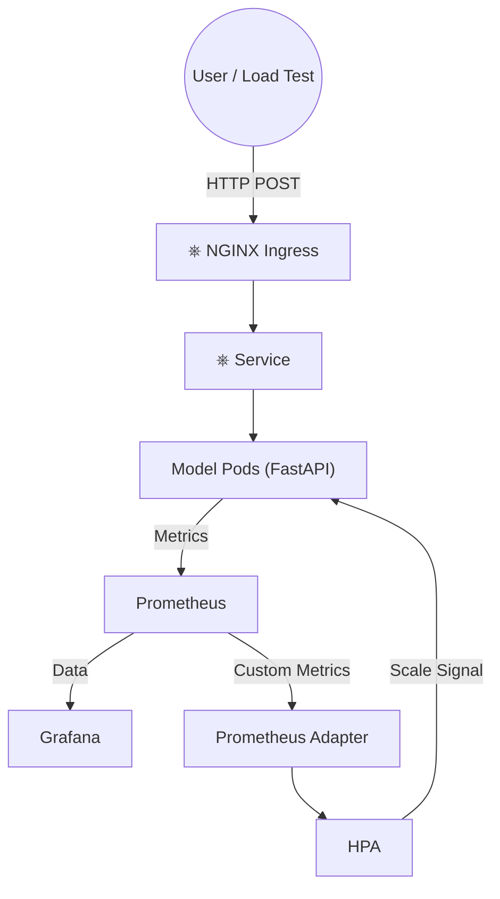

# MLOps Case Study: Scalable Sentiment Analysis Platform

This project implements a **production-grade MLOps architecture** for serving a Sentiment Analysis model on a local **Kubernetes (Kind)** cluster.
It goes beyond simple app deployment by adding:

- **Data Drift Monitoring**
- **Custom Metric Autoscaling (Throughput-based)**
- **Full Observability Stack (Prometheus + Grafana)**

---

# Architecture Overview

This system uses a closed-loop control system where **application metrics → drive infrastructure scaling**, ensuring performance during traffic spikes.



---

#  Tech Stack

### Infrastructure
- Kind (Kubernetes in Docker)
- Docker Desktop
- Helm
- Kubectl

### Model Serving
- FastAPI
- Uvicorn
- Python 3.9 Slim

### Monitoring & Autoscaling
- Prometheus
- Grafana
- Prometheus Adapter
- Horizontal Pod Autoscaler (HPA)

### Automation
- PowerShell scripts
- Python utilities

---

#  Quick Start (Windows PowerShell)

## 1. Prerequisites

Ensure you have installed and added to PATH:

- Docker Desktop (running)
- Kind
- Helm
- Kubectl
- Python 3.x

## 2. Spin Up Environment

```powershell
.\scripts\quickstart.ps1
```

Estimated time: **4–5 minutes**

## 3. Verify Deployment

```powershell
kubectl get pods
```

---

# Validation & Load Testing

## 1. Port Forwarding

### Terminal A: Grafana

```powershell
kubectl port-forward svc/monitor-grafana 3000:80
```

Access: http://localhost:3000  
User: admin  
Password: provided in script output

### Terminal B: Model API

```powershell
kubectl port-forward svc/sentiment-service 8000:80
```

## 2. Autoscaling Test

### Terminal C: Run Load Generator

```powershell
python scripts/auto_test.py
```

### Terminal D: Watch HPA Scaling

```powershell
kubectl get hpa -w
```

Expected Behavior:
- Traffic increases requests_per_second
- HPA uses Prometheus Adapter metrics
- Replica count scales from 1 → 10

---

#  Observability & Drift Detection

The Grafana Dashboard (`dashboard.json`) includes:

### Drift Monitor (Confidence Score)
- Green: healthy (>0.8)
- Red: drift (<0.6)
- Filters out idle data

### System Performance Panels
- Requests per second (RPS)
- P95 latency
- Active replicas during scaling events

---

#  Directory Structure

```
/deploy           # Kubernetes Manifests & Helm Configs
/infrastructure   # Kind Cluster Configuration
/model-service    # Python Application & Dockerfile
/scripts          # Automation & Testing Scripts
```

---

#  Cleanup

```powershell
.\scripts\cleanup.ps1
```
